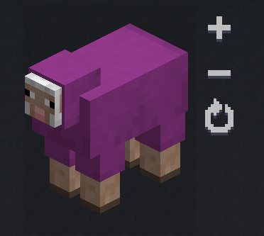

import Video from '@site/src/components/Video';

# Changelog

## 21.10.2-beta (Minecraft 1.21.10)

- Added support for data components to `<ItemLink />`

## 21.10.1-beta (Minecraft 1.21.10)

- First update to 1.21.10

## 21.8.4 (Minecraft 1.21.8)

- Markdown parse errors now log the line and column where the error occurred.

## 21.8.3 (Minecraft 1.21.8)

- Fix fluid rendering in game scenes

## 21.8.2 (Minecraft 1.21.8)

- Make the stripped down version of GuideME the default to be published to CurseForge/Modrinth (Reduces mod size by 5MB)
- Strip removed Lucene components from service files to fix startup crashes since NeoForge become stricter about service files

## 21.8.1 (Minecraft 1.21.8)

- First port to Minecraft 1.21.8
- The `/guidemec export` command to export guide data for web use now works
- Fixed rendering of in-world annotations in game scenes that was slightly broken since 1.21.5
- Fixed several export related problems present since 1.21.5
- Fixed error on startup complaining about an incubating JDK feature (vector), and the subsequent crash
  when that feature was actually enabled.

## 21.5.9-beta (Minecraft 1.21.5)

- Fix text in floating elements disappearing while scrolling.
- Fix layout of game scenes still including the vertical toolbar even if it was hidden.

## 21.5.8-beta (Minecraft 1.21.5)

- Add support for [templating annotations in game scenes](./30-authoring/game-scenes.md#block-annotation-templates). This allows you to apply annotations to specific blocks in the scene by type rather than position.
- Add the ability to position structures when they are placed by `<ImportStructure />` using the new `pos="x y z"` attribute.
  This change allows the same structure to be added multiple times to a scene at different positions.
- Add a new `<RemoveBlock id="..." />` tag to game scenes to clear out tags of a given type. This is useful for clearing out support blocks
  from structures after they have been imported into a scene. See the [game scene documentation](./30-authoring/game-scenes.md#remove-blocks) for details.
- Fix rendering of diamond overlay annotations in game scenes.

## 21.5.7-beta (Minecraft 1.21.5)

- Fix rendering of text in floated elements.
- Fix hover-status for widgets embedded in the document when the screen is scaled independently of the GUI (on odd GUI scales).
- Add `fallbackText` attribute to `<Recipe />`, `<RecipeFor />` and `<RecipesFor />` to allow the guide author to explicitly handle when recipes are missing due to datapacks removing them.
  See [authoring pages](./30-authoring/index.md#recipes) for details.
- Add a new configuration option to always hide recipe errors that result from recipes being removed or hidden by datapacks and guide authors not explicitly handling those cases with the `fallbackText` attribute.
  This is primarily intended to be used by modpacks.
- Adds the ability to color text both with a color specified in the page (`<Color color="#ff0000">text</Color>`), and by
  adding guide-specific custom color constants, both in [data-driven guides](./20-data-driven-guides.md#custom-colors)
  and for mods using an [extension point](./20-integration/symbolic-colors.md).

## 21.5.6-beta (Minecraft 1.21.5)

- Fix a crash when Minecraft uses an unusual language code with uppercase components (i.e. `en_US` instead of the default `en_us`).
- Added a `<PlayerName />` tag to address the player by their current name.
- Added a `<KeyBind id="..." />` tag to show what a keybind is currently bound to. See [authoring pages](./30-authoring/index.md#key-bindings) for details. 
  
## 21.5.5-beta (Minecraft 1.21.5)

- Adds the ability to specify data components on `ItemImage` and `ItemIcon` using the same format used by the `/give` command.
  For example: `<ItemImage id="minecraft:stone" components="enchantment_glint_override=true" />` shows a piece of stone with enchantment glint applied.
  
## 21.1.9 (Minecraft 1.21.1)

- Adds the ability to specify data components on `ItemImage` and `ItemIcon` using the same format used by the `/give` command.
  For example: `<ItemImage id="minecraft:stone" components="enchantment_glint_override=true" />` shows a piece of stone with enchantment glint applied.
  
## 21.1.8 (Minecraft 1.21.1)

- Remove a misplaced black pixel in the border of recipe panels.

## 21.5.4-beta (Minecraft 1.21.5)

- Fix item images being shown on top of the navigation bar.
- Use same random-source as normal level rendering to avoid constantly changing block appearance in game scenes.

## 21.1.7 (Minecraft 1.21.1)

- Guard against crashes when mods return null results from their custom recipes.

## 21.5.3-beta (Minecraft 1.21.5)

- Java API: Fix Off-Screen-Renderer for Website export.
- Java API: Fix various website export issues.
- Java API: Introduce new extension points for the site export,
  and make it usable via new system properties.

## 21.5.2-beta (Minecraft 1.21.5)

- Java API: Add back the semantics of `RecipeTypeMappings.add`, which supports mapping RecipeHolders to a nullable LytBlock for custom recipes.
- Java API: The registration method for factories that return a `Stream<LytBlock>` has been renamed to `addMulti`.
- Java API: Added convenience constructors to `LytSlot` for aiding with new idioms used by Vanilla, such as `Optional<Ingredient>` being used instead of empty ingredients (which no longer exist).
- Java API: Made the row/column factory methods for `LytSlotGrid` accept null-entries in the ingredient lists to better interface with Ingredients no longer being able to be empty.

## 21.5.1-beta (Minecraft 1.21.5)

- First port to Minecraft 1.21.5

## 21.1.6 (Minecraft 1.21.1)

- Fix wrapping of content in `<Row />` elements.
- Fix live-reload of translated pages in multi-language guides.
- Add `<RecipesFor id="minecraft:oak_log" />` to show all recipes that result in a given item. Combine this with a `<Row></Row>` element
  to get a wrapped list of recipes.
- Fix handling of dragging a document element (i.e. the camera in game scenes), when the mouse was released on a
  Minecraft UI element (such as the document navigation bar).
- Fix drawing not being flushed properly before/after the scissor region changes when using RenderContext.

## 21.1.5 (Minecraft 1.21.1)

- Disable the open guide hotkey from participating in building the creative menu search tree, which may have caused
  crashes if the player searches in the creative menu for the first time, while hovering over an item.

## 21.1.4 (Minecraft 1.21.1)

- Switch to Unicode line-breaking to improve breaking long lines for Chinese, Japanese, Korean, and other languages.

## 21.1.3 (Minecraft 1.21.1)

- Disable superfluous tracing code slowing down startup.

## 21.1.2 (Minecraft 1.21.1)

- Fix navbar content being cut off when it was scrolled down.

## 21.1.1 (Minecraft 1.21.1)

- Added support for [translating guides](./60-translation.md).
- Added an option for Players to disable loading of guide translations.
- Added support for the strikethrough Markdown extension (`~~text~~` or `~text~`).
- Added rendering for Markdown blockquotes.
- Added support for entities in game scenes using `<Entity />`. See [game scenes](./30-authoring/game-scenes.md#entity) for details.
  
- Add `<CommandLink command="/command" [title="tooltip"] [close={true}]>...</CommandLink>` that runs a command when clicked.
- Added a [tag for coloring text](./30-authoring/index.md#colored-text) using pre-defined colors, for use with the 16 default Minecraft colors.
- Fix several search issues relating to not analyzing queries properly, which reduced the number of relevant results.
- Fix returning to the original screen when the guide is closed.
- Improved visibility of the debug overlay text and outlines.
- Fix background panels in guide being drawn without depth test enabled, sometimes hiding other elements.
- Fix "Crafting (shapeless)" sometimes overflowing the recipe box and design an easier to use API for
  integrating custom recipe types.
- Fix a hidden navbar in guides without navigation still blocking interaction with elements below.
- Floating point attributes to custom tags can now be specified using MDX expression syntax too (i.e.: `<GameScene zoom={2.5}>`). 
  Please note that only bare floating point values are supported, no actual expressions.   
- Fatal Markdown parsing errors will now no longer crash the resource reload and instead replace the offending page with an error page.
- Cycles in the navigation tree will now be reported and no longer cause a stack overflow during resource reload.
- Fix scaling in `<ItemImage />` also scaling normals, which made items with 3d models appear too dark.

## 21.1.0 (Minecraft 1.21.1)

- Switching to the NeoForge versioning scheme, this version is equivalent to version 2.6.0, except for the following changes.
- Improved query parsing for full-text search. Search will now always apply "incremental" search for the last entered word,
  assuming the user might not have entered it fully yet. This means searching for "io po" will search for both "io po"
  and "io po*", although it will score an exact hit for "po" higher than a hit for "port" (for example).
- Fix parsing of links to pages where the mod-id contained underscores (i.e. `modern_industrialization:some_page.md`).
- Fix tooltip crash caused by wrong access transformer.

## 2.6.0 (Minecraft 1.21.1)

- Change the default layout of guides to be a centered column, and add a toolbar button to toggle between 
  full-width and centered-column layout.
  <Video src="center-column-layout.mp4" />
- Fix navigating between guide pages not appending to navigation history
- Add configuration screen
- Make scaling of Guide UI independent of UI scale for scales 1 and 3, where the uniform Minecraft font
  has severe rendering issues. This behavior can be disabled in the config screen (Adaptive Scaling).
- Added support for blast furnace recipes
- Do not show a navigation bar for guides that do not have any navigation items

## 2.5.1 (Minecraft 1.21.1)

- Fix shared recipe types not being collected correctly from the service loader

## 2.5.0 (Minecraft 1.21.1)

- Added an extension point for mods to add support for [custom recipe types](20-integration/recipe-types.md) to all guides
- Fixed an issue with navigating to the search screen

## 2.4.0 (Minecraft 1.21.1)

- Add missing Markdown node classes to API jar
- Add structure editing commands that only work in singleplayer:
    - `/guideme placeallstructures x y z` will place all structures found in all guidebooks
    - `/guideme placeallstructures x y z <guide>` will place all structures found in a given guidebook
    - `/guideme importstructure <origin>` opens a system file open dialog and places the selected structure file at the given origin
    - `/guideme exportstructure <origin> <size>` opens a system file save dialog and exports the given bounds as a structure file at the chosen location
- Fixes a resource reload crash when a page references a non-existing item as its navigation icon
- Added op command `/guideme give <target> <guide>` to quickly give a guide item to an entity target (i.e. `@s`)
- Fix guidebook navbar closing when clicking links

## 2.3.1 (Minecraft 1.21.1)

- Fixes a crash with the generic guide item if it has no guide id attached

## 2.3.0 (Minecraft 1.21.1)

- GuideME is now published on Maven Central instead of Modmaven
- The group id of the Maven artifact has changed from `appeng` to `org.appliedenergistics` 
  to enable publishing on Maven Central

## 2.2.0 (Minecraft 1.21.1)

- Added full-text search based on Apache Lucene, which is enabled for all guides:
  <Video src="guide-search.mp4" />
- Added `alignItems="start|center|end"` to the `Row` and `Column` tags to align content along the layout axis
- Added `fullWidth={true}` to the `Row` and `Column` axis to stretch them to the full width
- This enables `<Column alignItems="center" fullWidth={true}>...</Column>` to center content like images horizontally
- Fix the navigation bar sometimes opening and closing very slowly
- Store the navigation history on a per-guide basis, fixing "page not found" errors when switching back and forth between different guides.
- To limit the increase in Jar size due to Lucenes rather large volume, starting with this release,
  Proguard is enabled to strip unused parts of GuideMEs bundled dependencies (this saves about 5MB). There
  is some potential for `ClassNotFoundErrors` in cases where we missed required Proguard configuration.
  Please let us know if you find any errors!
- API additions
  - `ConstantColor#TRANSPARENT`
  - Added `index` method to `TagCompiler` to allow custom tags to control how they are indexed by search
    By default, all custom tags simply add their children to the indexer
  - Added the ability to set borders for `LytBox`
  - Generalized `GuideUiHost` into `DocumentUiHost`

## 2.1.2 (Minecraft 1.21.1)

- Skip fully invisible blocks (without block entities) when calculating the bounding box of a game scene. Fixes inexplicably larger bounds when blocks like `minecraft:light` where included in the exported structure.

## 2.1.1 (Minecraft 1.21.1)

- Fix race-condition crash when local file-system changes were processed before the resource reload was finished.

## 2.1.0 (Minecraft 1.21.1)

- Adds API to open guides for players from both server- and client-side
  - `GuidesCommon.openGuide(Player player, ResourceLocation guideId)` to open the last opened (or start-page if none) page of a guide for the given player.
  - `GuidesCommon.openGuide(Player player, ResourceLocation guideId, PageAnchor anchor)` to open a specific page of a guide for the given player.
- Moves the existing client-only command to `/guidemec`
- Adds a new server-side `/guideme` [command](./40-commands.md) that allows opening guides for target entities similar to `/tellraw`.
  This can be used to open guides using command blocks and other mechanisms.
  <Video src="command-block-guide.mp4" />
  Example: `/guideme open @s testmod:guide` to open the start page
  or `/guideme open @s testmod:guide page.md#anchor` to open a specific page at an anchor.
- Fix mod version being shown as 0.0.0

## 2.0.1 (Minecraft 1.21.1)

- Removes superfluous log spam when opening the creative menu.
