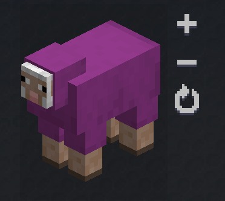

# Game Scenes

GuideME has a custom tag for interactive, real-time views of an in-game scenario.

```
<GameScene>
  ...
</GameScene>
```

The tag also supports the following attributes:

| Attribute  | Description                                                    |
|------------|----------------------------------------------------------------|
| zoom       | Allows the scene to be shown at a bigger scale. Defaults to 1. |
| background | A color value allowing to change the background of the scene.  |

To add actual content to the scene, add additional tags to the scene tag. The most important
tag will be `<ImportStructure />` to place a structure from a NBT or SNBT file in the scene.

In the following example, the structure from the `test.snbt` file located next to the page will be shown:

```
<GameScene zoom="4">
  <ImportStructure src="test.snbt" />
</GameScene>
```

The following subsections explain the different available tags within a `<GameScene />` tag.

## ImportStructure

As explained above, this tag will load a structure from the file supplied in the `src` attribute and
place it in the scene. Both `.nbt` and `.snbt` structure files are supported. The path given in `src`
can be relative to the current page.

To easily create such structure files, use the AE2 test-world (use `/ae2 setuptestworld` in a single-player creative
void-world).
It has a plot that provides LOAD/SAVE/CLEAR functionality in a 16x16 space to more easily author structures for the
guidebook.

The `ImportScene` tag can be used multiple times within a game scene, with the same or different structure files.

## Block

Example that shows a lit furnace next to an unlit one:

```
<GameScene>
    <Block id="minecraft:furnace" />
    <Block x="1" id="minecraft:furnace" p:lit="true" />
</GameScene>
```

This tag allows a single block to be set in the scene. When used with `id="minecraft:air"`, it can also be used
to clear blocks previously set by importing a structure (to hide certain blocks, for example a creative energy cell
used to power a setup).

The tag also supports the following attributes:

| Attribute  | Description                                                                                                         |
|------------|---------------------------------------------------------------------------------------------------------------------|
| id         | Id of the block to place.                                                                                           |
| x          | x coordinate of the block. Defaults to 0.                                                                           |
| y          | y coordinate of the block. Defaults to 0.                                                                           |
| z          | z coordinate of the block. Defaults to 0.                                                                           |
| `p:<name>` | Allows setting arbitrary block state properties on the block, where `<name>` is the name of a block state property. |

## Entity

You can add entities to your scene as well, using the `Entity` tag.

The attributes follow the format used by the `/summon` command:

| Attribute | Description                                                                                                           |
|-----------|-----------------------------------------------------------------------------------------------------------------------|
| id        | Entity type id as used by `/summon`. For example `minecraft:sheep`.                                                   |
| x         | x coordinate the entity is centered on. Defaults to 0.5.                                                              |
| y         | y coordinate at the bottom of the entity. Defaults to 0.                                                              |
| z         | z coordinate the entity is centered on. Defaults to 0.5.                                                              |
| rotationY | Sets the rotation around the Y axis of the entity in degrees. Defaults to -45.                                        |
| rotationX | Sets the rotation around the X axis of the entity in degrees. What effect this has depends on the entity.             |
| data      | Allows setting the initial NBT data of the entity. Uses the same format as `/summon`. Example: `{Color:2}` for sheep. |

Example:

```
<GameScene zoom={4} interactive={true}>
    <Entity id="minecraft:sheep" data="{Color: 2}" />
</GameScene>
```

Which shows as:



## IsometricCamera

This tag allows more fine-grained control over the isometric camera used to render the scene.

```
<GameScene>
    <Block id="minecraft:furnace" />
    <IsometricCamera yaw="30" roll="60" pitch="90" />
</GameScene>
```

The default rotation if this tag is not present is equivalent to:

```
<IsometricCamera yaw="225" pitch="30" />
```

The tag supports the following attributes:

| Attribute | Description                                                                         |
|-----------|-------------------------------------------------------------------------------------|
| yaw       | An angle (in degrees) that specifies the rotation around the Y-axis. Defaults to 0. |
| pitch     | An angle (in degrees) that specifies the rotation around the X-axis. Defaults to 0. |
| roll      | An angle (in degrees) that specifies the rotation around the Z-axis. Defaults to 0. |
