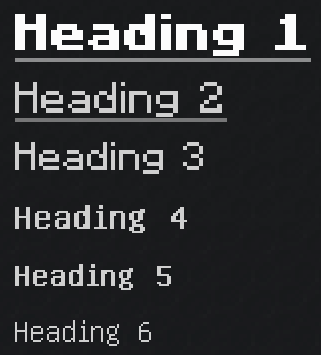
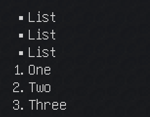

# Supported Markdown

To get started with Markdown, see the [CommonMark Reference](https://commonmark.org/help/).

## Specifications

GuideME is based on the [micromark](https://github.com/micromark/micromark) Markdown parser, which supports:

- [CommonMark](https://spec.commonmark.org/0.31.2/)
- A subset of [GitHub Flavored Markdown](https://github.github.com/gfm/)
    - [Tables](https://github.github.com/gfm/#tables-extension-)
    - [Strikethrough](https://github.github.com/gfm/#strikethrough-extension-)
- [YAML Frontmatter](https://github.com/micromark/micromark-extension-frontmatter)

## Inline Formatting

| Markdown                   | Alternative       | Result                                         |
|----------------------------|-------------------|------------------------------------------------|
| `*Italic*`                 | `_Italic_`        |                |
| `**Bold**`                 | `__Bold__`        |                    |
| `~~Strikethrough~~`        | `~Strikethrough~` |  |
| `[Link](http://a.com)`     |                   |                    |
| `[Link](./index.md)`       |                   |                    |
| `[Link](testmod:index.md)` |                   |                    |
| `` `Inline Code` ``        |                   |      |
| ``       |                   |                  |

## Headings

Headings can be defined by prefixing them with `#`.

```markdown
# Heading 1

## Heading 2

### Heading 3

#### Heading 4

##### Heading 5

###### Heading 6
```

Result:



## Other Block Elements

Horizontal Rule:

Markdown:

```
---
```

Result:


Markdown:

`> Blockquote`

Result:


## Lists

Markdown:

```
- List
- List
- List 

1. One
2. Two
3. Three
```

Result:



## Tables

Markdown:

```
| First Header  | Second Header |
| ------------- | ------------- |
| Content Cell  | Content Cell  |
| Content Cell  | Content Cell  |
```

Result:


