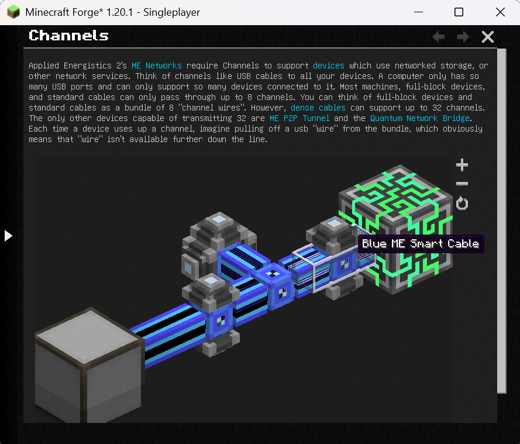

# Overview

GuideME offers the foundation for your mods or modpacks guidebook. Based on the technology powering [Applied Energistics
2](https://appliedenergistics.org)s guidebook, it allows you to write your guide in simple Markdown, while embedding 3d scenes straight from structure
files.

For players, guides based on GuideME offer:

- Smooth scrolling goodness
- Content being front and center, with an advanced text layout engine supporting reflow and inline elements
- Interactive 3D scenes with annotations, intuitively illustrating concepts from your mod
- Cross-linking between topics and quick information in link tooltips
- Showing inline-recipes in your guidebook "JEI-Style"
- Offers the ability to "hold G" to quickly jump to the relevant guidebook page in any item tooltip

For modders, it offers a rich extensibility API, allowing you to:

- Add custom inline or block tags to Markdown, backed by a custom Widget system
- Extend the recipe rendering to display your custom recipes in the guide
- Use custom Markdown front-matter to easily add arbitrary information to guidebook pages
- Use custom indices to quickly find pages based on custom attributes
- Allow resource packs or addons to add their own content to your guide

## Example

The following is an example page from the AE2 guidebook (source).

```
---
navigation:
  parent: ae2-mechanics/ae2-mechanics-index.md
  title: Channels
  icon: controller
---

# Channels

Applied Energistics 2's [ME Networks](me-network-connections.md) require
Channels to support [devices](../ae2-mechanics/devices.md) which use networked storage, or other network
services. Think of channels like USB cables to all your devices. A computer only has so many USB ports and can only support
so many devices connected to it. Most machines, full-block devices, and standard cables can only pass through
up to 8 channels. You can think of full-block devices and standard cables as a bundle of 8 "channel wires". However, [dense cables](../items-blocks-machines/cables.md#dense-cable) can support up
to 32 channels. The only other devices capable of transmitting 32 are <ItemLink id="me_p2p_tunnel" />
and the [Quantum Network Bridge](../items-blocks-machines/quantum_bridge.md). Each time a device uses up a channel, imagine pulling off a usb "wire" from
the bundle, which obviously means that "wire" isn't available further down the line.

<GameScene zoom="7" interactive={true}>
  <ImportStructure src="../assets/assemblies/channel_demonstration_1.snbt" />
</GameScene>
```


